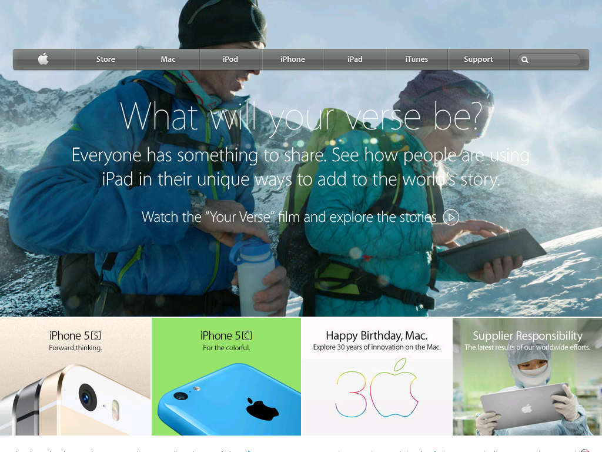

# apple-clone

This is the fourth project of the Main HTML/CSS curriculum at [Microverse](https:www.microverse.org/) - @microverseinc.

# apple-clone ([The Odin Project](https://www.theodinproject.com/courses/html5-and-css3/lessons/building-with-backgrounds-and-gradients)

## Built With

- HTML5 
- CSS3

## Live Demo

[Live Demo](https://rawcdn.githack.com/Bluette1/apple-clone/a6bb9f2f4c34fd3c1ab68d7c6174fe1975aabca2/index.html)

## Authors

👤 **Marylene Sawyer**
- Github: [@Bluette1](https://github.com/Bluette1)

## 📝 License

This project is [MIT](https://opensource.org/licenses/MIT) licensed.